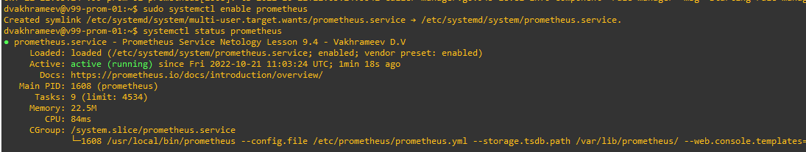

# 9.4.-Prometheus

---

## HomeWork

---

1. 

2. 

3. 
```angular2html
global:
  scrape_interval: 15s
  scrape_timeout: 10s
  evaluation_interval: 15s
alerting:
  alertmanagers:
  - follow_redirects: true
    enable_http2: true
    scheme: http
    timeout: 10s
    api_version: v2
    static_configs:
    - targets: []
scrape_configs:
- job_name: prometheus
  honor_timestamps: true
  scrape_interval: 15s
  scrape_timeout: 10s
  metrics_path: /metrics
  scheme: http
  follow_redirects: true
  enable_http2: true
  static_configs:
  - targets:
    - localhost:9090
- job_name: node_exporter_clients
  honor_timestamps: true
  scrape_interval: 5s
  scrape_timeout: 5s
  metrics_path: /metrics
  scheme: http
  follow_redirects: true
  enable_http2: true
  static_configs:
  - targets:
    - 192.168.56.152:9100
    - 192.168.56.150:9100
    - 192.168.56.142:9100
```


4. 